# Trustless Notes

Trustless Notes is a privacy-first encrypted notes app built with Next.js.
It uses local key derivation and client-side encryption so note plaintext and user passwords are never sent to the server.

## Project Description

The app demonstrates a trust-minimized architecture for personal notes:

- Passwords are never stored server-side.
- A strong encryption key is derived in the browser via PBKDF2 (200,000 iterations, SHA-256).
- Notes are encrypted with AES-256-GCM before upload.
- The backend stores only ciphertext, IVs, salts, and wrapped note keys.
- Authentication uses a signed HTTP-only cookie and anti-enumeration signin behavior.
- Includes an attack simulator page to study common leakage scenarios.

## Tech Stack

- Next.js App Router + TypeScript
- Web Crypto API (PBKDF2, AES-GCM, ECDH)
- Supabase (Postgres) for persistence
- Zustand for in-memory client session/note state
- Radix UI (used in dashboard interactions)

## Security Model (High Level)

- Signup:
  The browser derives a key from the user password, encrypts a sentinel value, and sends only cryptographic artifacts.
- Signin:
  The server returns a real or fake sentinel payload. Password verification happens by local decryption, reducing username enumeration risk.
- Session:
  The server signs a username cookie with HMAC-SHA256.
- Notes:
  Each note has its own AES key; that key is wrapped by the derived user key before storage.

## Main Routes

- / -> landing page
- /signup -> create encrypted account artifacts
- /signin -> local password verification flow
- /dashboard -> encrypted notes workspace
- /simulator -> cryptography/attack simulation pages

## User Flow Diagram

```mermaid
flowchart LR
	U1[User opens Sign Up or Sign In] --> A{New user?}

	%% Signup path
	A -- Yes --> S1[Enter username + password]
	S1 --> S2[Browser: derive key + encrypt sentinel + generate ECDH keys]
	S2 --> S3[API: POST /api/auth/signup]
	S3 --> S4{Username free?}
	S4 -- No --> SE[Show Username taken]
	S4 -- Yes --> S5[API: set signed session cookie]
	S5 --> S6[Browser: store derived key in memory]
	S6 --> D0[Go to Dashboard]

	%% Signin path
	A -- No --> I1[Enter username + password]
	I1 --> I2[API: POST /api/auth/signin returns real/fake sentinel]
	I2 --> I3[Browser: derive key from password + salt]
	I3 --> I4{Sentinel decrypts to VALID_PASSWORD?}
	I4 -- No --> IE[Show Invalid credentials]
	I4 -- Yes --> I5[API: set signed session cookie]
	I5 --> I6[Browser: store derived key in memory]
	I6 --> D0

	%% Create note path
	D0 --> N1[Click New Note]
	N1 --> N2{Derived key present?}
	N2 -- No --> N2E[Redirect to Sign In]
	N2 -- Yes --> N3[Browser: generate per-note AES key]
	N3 --> N4[Encrypt title/content + wrap note key]
	N4 --> N5[API: POST /api/notes/create]
	N5 --> N6{Session cookie valid?}
	N6 -- No --> N6E[401 Unauthorized]
	N6 -- Yes --> N7[DB insert encrypted note]
	N7 --> N8[Return note id]
	N8 --> N9[Dashboard store adds note + opens editor]

	classDef user fill:#E6FFFB,stroke:#0F766E,color:#083344,stroke-width:1.2px;
	classDef crypto fill:#E0E7FF,stroke:#3730A3,color:#1E1B4B,stroke-width:1.2px;
	classDef api fill:#E0F2FE,stroke:#0369A1,color:#082F49,stroke-width:1.2px;
	classDef db fill:#FEF3C7,stroke:#B45309,color:#78350F,stroke-width:1.2px;
	classDef ok fill:#DCFCE7,stroke:#15803D,color:#14532D,stroke-width:1.2px;
	classDef err fill:#FEE2E2,stroke:#B91C1C,color:#7F1D1D,stroke-width:1.2px;

	class U1,A,S1,I1,N1,N2,D0 user;
	class S2,I3,I4,N3,N4 crypto;
	class S3,S5,I2,I5,N5,N6,N8 api;
	class N7 db;
	class S6,I6,N9 ok;
	class SE,IE,N2E,N6E err;
```

